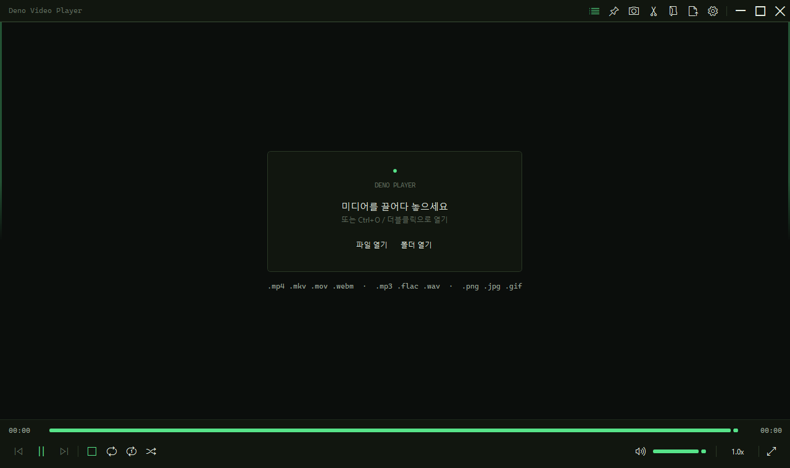

# Deno Video Player

가볍고 빠른 Windows용 로컬 미디어 플레이어입니다. 영상, 오디오, 이미지를 빠르게 열어
확인하는 데 집중합니다.

광고 없음. 계정 없음. 클라우드 동기화 없음. 텔레메트리 없음.



## Download

**처음 설치한다면 이것만 받으면 됩니다.**

[Download DenoVideoPlayer-win-Setup.exe](https://github.com/Deno2026/deno-video-player/releases/latest/download/DenoVideoPlayer-win-Setup.exe)

1. `DenoVideoPlayer-win-Setup.exe` 다운로드
2. 실행
3. `Deno Video Player` 실행 후 파일을 끌어다 놓기

첫 실행 때 필요한 재생 엔진을 자동으로 준비합니다. Windows SmartScreen이 뜰 수
있습니다. GitHub Releases에서 받은 파일이 맞다면 `More info` -> `Run anyway`로
진행하면 됩니다.

## What It Does

- 비디오, 오디오, 이미지 파일 빠르게 열기
- 파일을 열면 같은 폴더의 미디어를 자동 재생목록으로 구성
- 오른쪽 가장자리 hover로 재생목록, 왼쪽 가장자리 hover로 최근 파일 열기
- 더블클릭, `F`, `Enter`로 전체화면
- 스크린샷 저장
- 재생속도 프리셋
- 간단한 무손실 구간 추출
- 새 버전 알림 후 사용자가 클릭할 때만 업데이트

## Portable Option

설치 없이 쓰고 싶다면 Releases에서
`portable-win-x64.zip` 이름의 portable zip을 받을 수 있습니다.
압축을 풀고 `DenoVideoPlayer.exe`를 실행하면 됩니다.

초보자에게는 `Setup.exe`를 권장합니다.

## Trim Clips

필요한 구간만 빠르게 저장할 수 있습니다.

1. `I`로 시작점 지정
2. `O`로 끝점 지정
3. `Ctrl + E`로 저장

원본 폴더에 `_clip_시작-종료` 파일이 만들어집니다. FFmpeg stream copy 방식이라
재인코딩 없이 빠르고 화질 손실이 없습니다. 다만 키프레임 단위라 시작/끝 지점이
몇 초 정도 달라질 수 있습니다.

## Shortcuts

| 기능 | 단축키 |
|---|---|
| 재생/일시정지 | `Space` |
| 길게 누르는 동안 2배속 | `Space` hold |
| 5초 이동 | `←` / `→` |
| 30초 이동 | `Shift + ←` / `Shift + →` |
| 볼륨 | `↑` / `↓` 또는 마우스 휠 |
| 음소거 | `M` |
| 전체화면 | `F` / `F11` / `Enter` / `Alt + Enter` / 더블클릭 |
| 전체화면 해제 | `Esc` |
| 이전/다음 파일 | `PageUp` / `PageDown` 또는 `Ctrl + ←` / `Ctrl + →` |
| 배속 조절 | 하단 `1.0x` 버튼 또는 `Shift + .` / `Shift + ,` |
| 스크린샷 | `Ctrl + S` |
| 항상 위 | `Ctrl + T` |
| 재생목록 | `P` / `Ctrl + L` |
| 자막 표시/전환 | `V` / `Shift + V` |
| 오디오 트랙 전환 | `Ctrl + J` |
| 구간 추출 | `I` -> `O` -> `Ctrl + E` |

## Supported Files

- Video: `.mp4 .mkv .mov .webm .avi .m4v .ts .mts .m2ts .wmv .flv .3gp`
- Audio: `.mp3 .wav .flac .aac .m4a .ogg .opus .wma .alac`
- Image: `.jpg .jpeg .png .webp .bmp .gif`
- Subtitles: `.srt .ass .ssa .vtt .sub .idx .sup .smi`

## What It Does Not Do

Deno Video Player intentionally avoids heavy media-library behavior.

No ads, login, cloud sync, analytics, recommendations, store, plugin marketplace,
codec-pack prompts, background library indexing, timeline editor, or AI features.

## Build From Source

```powershell
dotnet restore DenoVideoPlayer.sln
dotnet test .\DenoVideoPlayer.sln --configuration Release
dotnet publish .\DenoVideoPlayer.csproj -c Release -r win-x64 --self-contained true -o .\publish\DenoVideoPlayer-win-x64
```

## License

Code is MIT licensed. See [LICENSE](LICENSE) and [NOTICE.md](NOTICE.md).

Playback uses mpv as an external process. Public packages do not redistribute mpv
or FFmpeg binaries; the app prepares them on the user's machine when needed.
