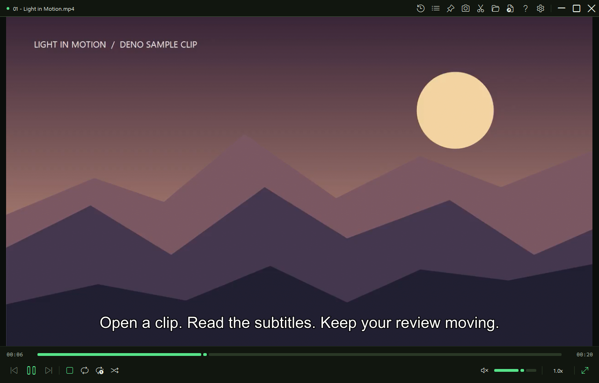

# Deno Video Player

English | [Korean](docs/README.ko.md) | [Japanese](docs/README.ja.md) | [Simplified Chinese](docs/README.zh-CN.md) | [Spanish](docs/README.es.md) | [Portuguese (Portugal)](docs/README.pt-PT.md) | [Portuguese (Brazil)](docs/README.pt-BR.md) | [Indonesian](docs/README.id.md)

**A clean Windows media player for quickly checking local video, audio, images, and subtitles.**

No ads. No account. No cloud sync. No telemetry. Just open a file and watch.

**Latest stable:** [v0.5.3](https://github.com/Deno2026/deno-video-player/releases/tag/v0.5.3) · Published August 2, 2026



*Actual playback with subtitles, using a Deno-created sample clip. The app interface supports English and Korean. [First-launch screen](docs/assets/preview.png).*

## ✨ Why It’s Useful

- Fast drag-and-drop playback for local media files
- Automatically builds a playlist from the same folder
- Toolbar buttons and slim center-edge handles for recent files and the playlist
- Screenshots with `Ctrl + S`
- Video zoom with `Ctrl + mouse wheel`, then pan with middle-button drag
- Simple lossless clip trimming with `I` → `O` → `Ctrl + E`
- An explicit fullscreen button for a clean video-only view
- A built-in quick guide and practical shortcut reference with `F1`
- English and Korean app interface in Settings
- Updates are shown first and installed only when you choose them

## 🚀 Install in 3 Steps

1. Download the latest installer:
   [DenoVideoPlayer-win-Setup.exe](https://github.com/Deno2026/deno-video-player/releases/download/v0.5.3/DenoVideoPlayer-win-Setup.exe)
2. Run the installer.
3. Open **Deno Video Player**, then drag a media file into the window.

On the first launch, the app prepares the playback engine it needs. This is normally a one-time setup.

If Windows SmartScreen appears, check that the file came from the official GitHub Releases page, then choose **More info** → **Run anyway**.

### System requirements

- Windows 10 or Windows 11, x64
- Internet access on the first launch to prepare the mpv playback engine
- Internet access on the first clip/audio/video export to prepare FFmpeg

## ❓ Built-in Guide

Click the `?` button beside Settings or press `F1` at any time. The guide explains:

- where the Recent files and current-folder playlist panels are located
- the main top-bar tools and playback controls
- keyboard and mouse shortcuts
- subtitles, audio tracks, screenshots, zoom, and pan
- clip, audio-only, and video-only export
- first-launch and playback troubleshooting

The empty player also includes a **New here?** link, and playback failures link directly to the troubleshooting section.

## 📦 Portable Option

Prefer not to install? Download [DenoVideoPlayer-v0.5.3-portable-win-x64.zip](https://github.com/Deno2026/deno-video-player/releases/download/v0.5.3/DenoVideoPlayer-v0.5.3-portable-win-x64.zip), unzip it, and run `DenoVideoPlayer.exe`.

For most beginners, the `Setup.exe` installer is the easier choice.

## 🎬 What You Can Do

### Open and Review Media Quickly

Drop a video, audio file, image, or subtitle-friendly video into the player. Deno Video Player focuses on fast local review, not library management.

`F`, a double-click in the viewing area or title bar, and the upper/lower-right size buttons all share one action: a normal window enters fullscreen; fullscreen or a Windows-maximized window returns to its previous normal size. This also works with an empty player, while loading, or after playback fails. To open media, use **Open file** / **Open folder**, `Ctrl + O`, or drag and drop.

### Browse the Same Folder

When you open one file, the app can use nearby media files in the same folder as a simple playlist. This is useful for checking renders, exports, references, and downloaded clips.

Open Recent files from the toolbar or with `Ctrl + H`. Open the current-folder playlist from its toolbar button or with `P` / `Ctrl + L`. Sort it by natural file name, newest first, or oldest first; the selected order is remembered and also controls previous/next navigation.

For a quick look, hover the slim handle at the center of the left edge for Recent files or the right edge for the playlist. These pop-up panels close when you move away from both the handle and panel. Panels opened with a toolbar button or shortcut stay open until you close or switch them.

The bottom controls include repeat off, repeat all, repeat one, shuffle, volume, playback speed, and fullscreen. Click the speed value for presets or use the mouse wheel over it for 0.25x changes.

### Trim a Clip Without Re-encoding

Use:

1. `I` to mark the start point
2. `O` to mark the end point
3. `Ctrl + E` to save the clip

The trim feature uses FFmpeg stream copy, so it is fast and does not re-encode the video. Start and end points may land near keyframes instead of the exact visible frame.

From trim mode, you can save the full clip, extract audio only, or extract video only.
FFmpeg is prepared on demand for the first export, and that download can be large.

## 🧩 Supported Files

- **Video:** `.mp4 .mkv .mov .webm .avi .m4v .ts .mts .m2ts .wmv .flv .3gp`
- **Audio:** `.mp3 .wav .flac .aac .m4a .mka .ogg .opus .wma .alac`
- **Image:** `.jpg .jpeg .png .webp .bmp .gif`
- **Subtitles:** `.srt .ass .ssa .vtt .sub .idx .sup .smi`

## 🌍 Language Support

The app interface currently supports:

- English
- Korean

You can change the display language in **Settings**.

## ⌨️ Handy Shortcuts

| Action | Shortcut |
| --- | --- |
| Play / pause | `Space` |
| Hold 2x speed | Hold `Space` |
| Seek 5 seconds | `←` / `→` |
| Seek 30 seconds | `Shift + ←` / `Shift + →` |
| Volume | `↑` / `↓` or mouse wheel |
| Video zoom / pan | `Ctrl + mouse wheel` / middle-button drag |
| Mute | `M` |
| Fullscreen / restore window | `F` / `F11` / `Enter` / `Alt + Enter` / double-click the viewing area or title bar |
| Exit fullscreen | `Esc` |
| Previous / next file | `PageUp` / `PageDown` or `Ctrl + ←` / `Ctrl + →` |
| Screenshot | `Ctrl + S` |
| Always on top | `Ctrl + T` |
| Recent files | `Ctrl + H` |
| Playlist | `P` / `Ctrl + L` |
| Subtitle track | `V` / `Shift + V` |
| Audio track | `Ctrl + J` |
| Trim clip | `I` → `O` → `Ctrl + E` |
| Help and shortcuts | `F1` |

## 🔒 What It Does Not Do

Deno Video Player intentionally avoids heavy media-library behavior.

It does not include ads, login, cloud sync, analytics, recommendations, background library indexing, a store, plugin marketplace, timeline editor, or AI features.

## 🗒️ Updates

See [CHANGELOG.md](CHANGELOG.md) for recent user-facing changes.

## 🛠️ Developer Notes

```powershell
dotnet restore DenoVideoPlayer.sln
dotnet test .\DenoVideoPlayer.sln --configuration Release
dotnet publish .\DenoVideoPlayer.csproj -c Release -r win-x64 --self-contained true -o .\publish\DenoVideoPlayer-win-x64
```

## 🧾 License

Deno Video Player source code is released under [GNU GPL v3.0](LICENSE) (`GPL-3.0-only`). You can use, study, modify, and redistribute it, including commercially. Distributed modified versions must follow GPL-3.0 and preserve the required license and copyright notices.

Third-party tools such as mpv, FFmpeg, Velopack, and 7-Zip remain under their own licenses. See [NOTICE.md](NOTICE.md) for details.
